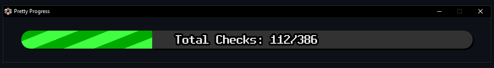
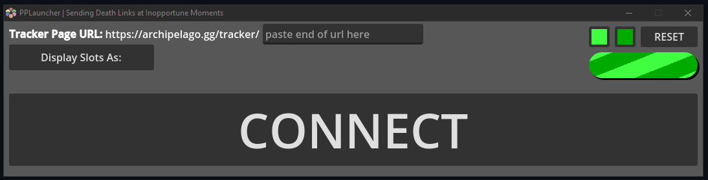

# Pretty Progress
Connects to an Archipelago Multiworld Room and displays a progress bar in a transparent window. Intended for streamers.

## What This Does

This program connects to the Multiworld Tracker of an [Archipelago](https://archipelago.gg/) room and cycles through each slot and the total, showing progression. Slots fade in and out on a timer, and the window is transparent for easy addition to a stream layout for streamers playing through Archipelago seeds.

## What This Does Not Do

This program does not connect to any player slots or do any sort of logic tracking. It simply takes the URL of the Multiworld Tracker and displays progress.

## Features

- Customizable progress bar colours
- Option to display slots as `player` names or `game` names
- Toggle to show checks as fractions or percentages
- Toggle to hide completed slots

## Usage
Download the latest release for your platform from the [releases page](https://github.com/GirambQuamb/Archipelago-Pretty-Progress/releases), extract `Pretty_Progress_x.x.x.zip`, and run the executable ensuring it is in the same folder as `Pretty Progress.pck`.

This will launch the `PPLauncher` window, in which you can paste the URL of an Archipelago room and configure options.

Click the `CONNECT` button to launch the `Pretty Progress` window that displays the progress bar in a transparent window. To change settings or fix invalid URLs, first close the `Pretty Progress` window. Invalid URLs will prompt an error message.

In OBS, the `Pretty Progress` window can be captured as a Window Capture source, and will be transparent as long as the chosen `Capture Method` supports it. Game works as well with `Allow Transparency` enabled, but you may run into issues with it capturing the launcher window.

## Shortcomings & Planned Features

- Rooms with only one player slot will show the `Loading` text during the first transition cycle. This will fix itself in time for capture.
- There is only [one font](https://not-jam.itch.io/not-jam-mono-clean-13) for progress display. I've not personally tested which characters are valid. Code is in place to add more options for fonts, including the possibility of a custom font.
- No settings are saved, though colour palettes can be imported and exported from the color picker. Thanks, Godot!
- More options for displaying slot names are being considered.
- The launch window is ugly and windows are not resizeable.
